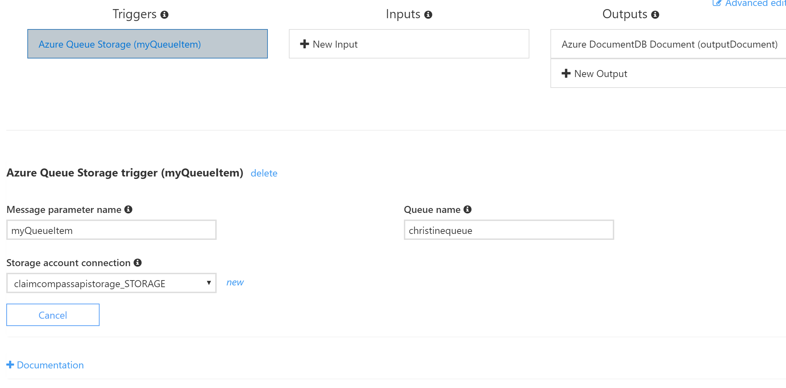

# QueueTrigger - JavaScript

The `QueueTrigger`is a function that runs when there is an item in the queue. This function sends an output to a DocumentDB.

## Azure Function Configuration -Integrate

### Triggers: Azure Queue Storage (myQueueItem) 

Every time a message appears in `christinequeue` it gets processed by the function.

### Outputs: Azure Queue Storage (outputDocument)

In our code, we have the output parameter name as `outputDocument`

The DocumentDB is `checkedflights_DocumentDB` and the collection is called `checkedflights`

## Azure Function Configuration - Manage

These were just left as the defaults

##Azure Function -  Monitor

These were just left as the defaults. This page tells us every time it ran and the success rate. 

