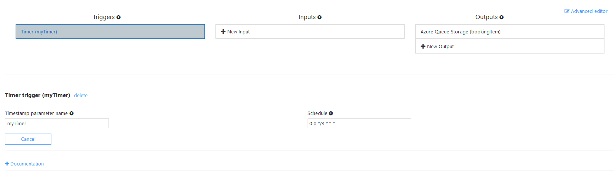
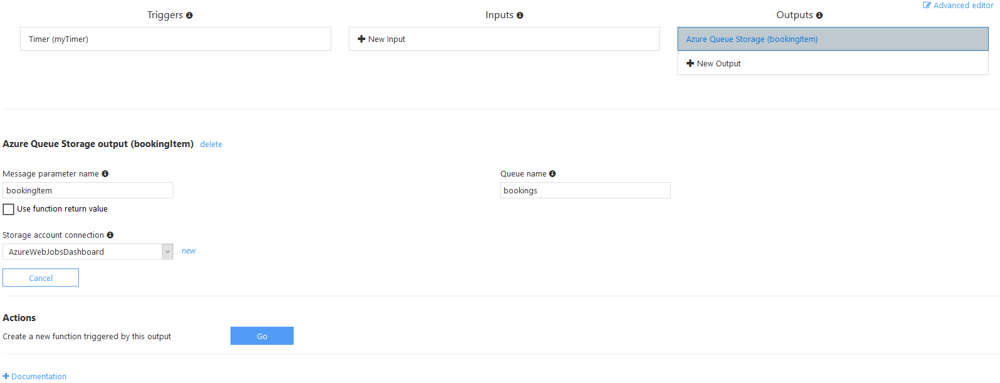
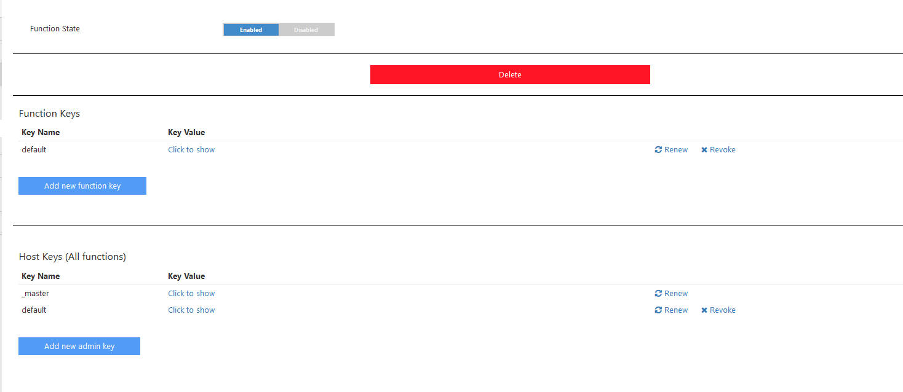
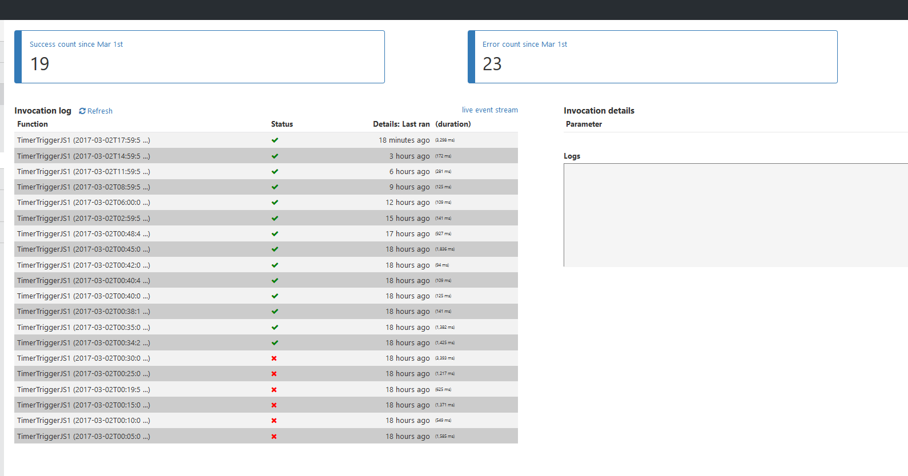

# TimerTrigger - JavaScript

The `TimerTrigger` makes it incredibly easy to have your functions executed on a schedule. This calls our function every 3 hours.

## How it works

For a `TimerTrigger` to work, you provide a schedule in the form of a [cron expression](https://en.wikipedia.org/wiki/Cron#CRON_expression)(See the link for full details). A cron expression is a string with 6 separate expressions which represent a given schedule via patterns. The pattern we use to represent every 5 minutes is `0 */5 * * * *`. This, in plain text, means: "When seconds is equal to 0, minutes is divisible by 5, for any hour, day of the month, month, day of the week, or year".

## Azure Function Configuration - Integrate

#### Triggers: Timer (MyTimer)

This CRON expression is set on the schedule to run every three hours `0 0 */3 * * *` 

#### Outputs: Azure Queue Storage (bookingItem)

In our code, we have the output parameter name `bookingItem`

The Azure Storage Account is `claimcompassapistorage_STORAGE` and the queue is called `bookings`

## Azure Function Configuration - Manage

These were just left as the defaults

##Azure Function -  Monitor
These were just left as the defaults. This page tells us every time it ran and the success rate. 

